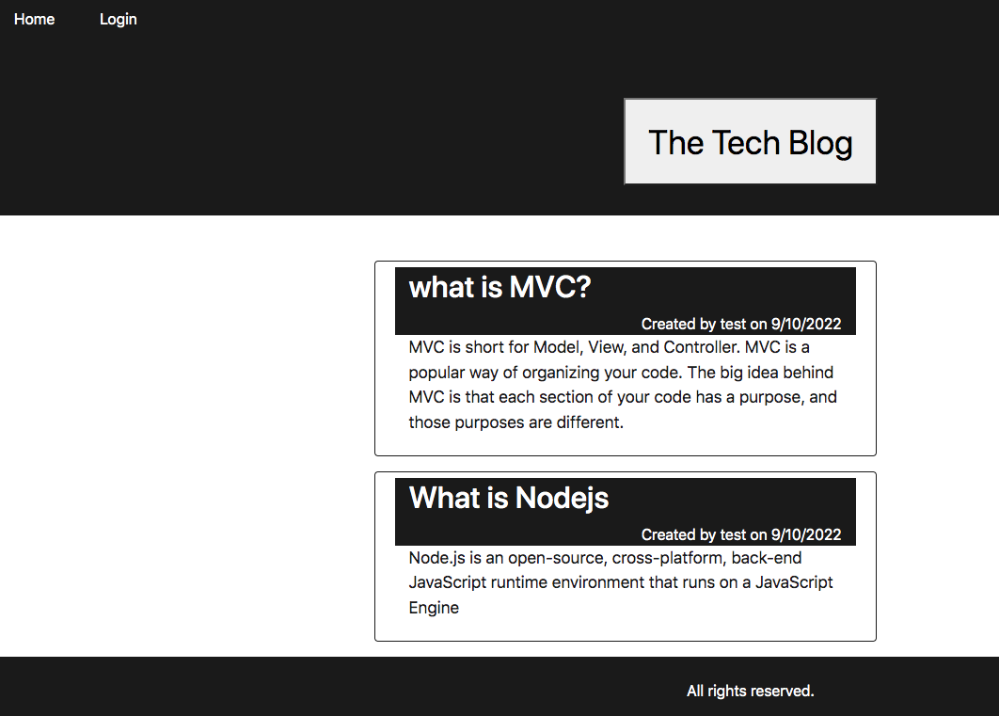

# Tech Blog

This is a CMS-style blog site similar to a Wordpress site, where developers can publish their blog posts and comment on other developers’ posts as well.

## Functionality

```
WHEN you visit the site for the first time
THEN you will be presented with the homepage, which includes existing blog posts if any have been posted; navigation links for the homepage and the dashboard; and the option to log in
WHEN you click on the homepage option
THENyou will be taken to the homepage
WHEN you click on any other links in the navigation
THEN you will be prompted to either sign up or sign in
If you choose to sign up
THEN you will be prompted to create a username and password
WHEN you will click on the sign-up button
THEN your user credentials are saved and you will be logged into the site
WHEN you revisit the site at a later time and choose to sign in
THEN ypu will be prompted to enter my username and password
WHEN you will be signed in to the site
THEN you will see navigation links for the homepage, the dashboard, and the option to log out
WHEN you click on the homepage option in the navigation
THEN you will be taken to the homepage and presented with existing blog posts that include the post title and the date created
WHEN you click on an existing blog post
THEN you will be presented with the post title, contents, post creator’s username, and date created for that post and have the option to leave a comment
WHEN you enter a comment and click on the submit button while signed in
THEN the comment is saved and the post is updated to display the comment, the comment creator’s username, and the date created
WHEN you click on the dashboard option in the navigation
THEN you will be taken to the dashboard and presented with any blog posts you have already created and the option to add a new blog post
WHEN you click on the button to add a new blog post
THEN you will be prompted to enter both a title and contents for my blog post
WHEN you click on the button to create a new blog post
THEN the title and contents of my post are saved and you will be taken back to an updated dashboard with my new blog post
WHEN you click on one of my existing posts in the dashboard
THEN you will be able to delete or update my post and taken back to an updated dashboard
WHEN you click on the logout option in the navigation
THEN you will be signed out of the site
WHEN you are idle on the site for more than a set time
THEN you will be able to view comments but I am prompted to log in again before I can add, update, or delete comments
```

## Mock-Up

The following animation demonstrates the application functionality:




---
© 2022 Nancy S All Rights Reserved.
